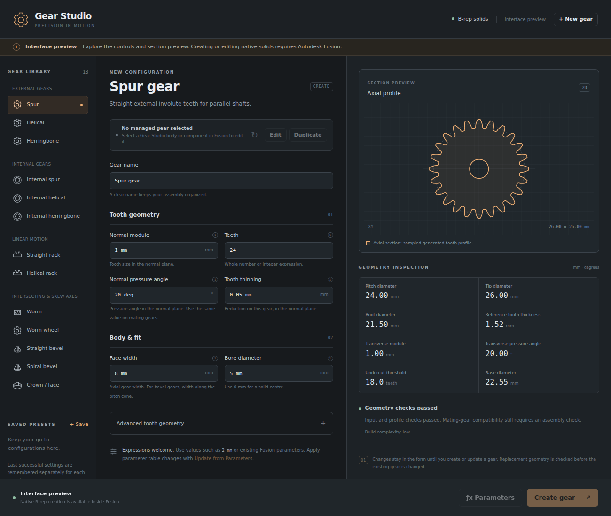

# Gear Studio

[](https://github.com/tensegrity-audio/fusion-gear-add-on/actions/workflows/ci.yml)

**Native B-rep gears for Autodesk Fusion, with editable definitions, real user parameters and remembered settings.**

Gear Studio is a local desktop add-in. Its panel brings tooth settings, a lightweight profile preview, dimensional checks and saved presets into one place. It generates solid bodies, not polygon meshes.

This is an initial implementation for evaluation. Its Python logic and interface can be checked outside Fusion; native modeling, command transactions and cross-platform installation still require the live Fusion acceptance runs in [docs/ACCEPTANCE.md](docs/ACCEPTANCE.md). Do not interpret the available family list as a completed manufacturing or platform certification.



The [verification record](docs/VERIFICATION.md) separates completed automated checks from pending live Fusion acceptance.

| Start here | Purpose |
| --- | --- |
| [Install](docs/INSTALL.md) | Download or clone, install, update and roll back |
| [Research and design decisions](docs/RESEARCH.md) | Existing alternatives, overlap and the gaps this project targets |
| [Architecture](docs/ARCHITECTURE.md) | Definitions, native solids, parameters and recovery |
| [Roadmap](docs/ROADMAP.md) | Remaining verification and future capabilities |
| [Contributing](CONTRIBUTING.md) | Development setup, tests and useful bug reports |
| [Changelog](CHANGELOG.md) | What changed and what is still pending |

## Get started

**Keep Gear Studio in `Documents\FusionAddins\fusion-gear-add-on`.** The recommended installation links this folder inside Fusion. No PowerShell installer, Git or separate Python installation is needed for the ZIP route.

1. Save your designs and close Fusion. On [GitHub](https://github.com/tensegrity-audio/fusion-gear-add-on), choose **Code > Download ZIP**, then use **Extract All** in File Explorer.
2. Find the extracted folder that directly contains `README.md` and the inner `GearStudio` folder. Move that repository folder into **Documents > FusionAddins** and name it **fusion-gear-add-on**. Create FusionAddins if needed.
3. Start Fusion and open **Utilities > Add-Ins > Scripts and Add-Ins**. Choose **+ > Script or add-in from device** and select **Documents > FusionAddins > fusion-gear-add-on > GearStudio**. In the older dialog, use the **Add-Ins** tab's **+** button.
4. Select **GearStudio**, click **Run**, and optionally enable **Run on Startup**. Keep the linked folder in Documents.
5. Open a new Part or Hybrid design with **Capture Design History** enabled. Start with the default **Spur** settings for your first verification.
6. Select the generated body or component and choose **Edit** in Gear Studio to change it. Save the Fusion document to retain its gear definition.

**[Full installation instructions](docs/INSTALL.md)** include the exact folder checks, Windows Git commands that locate your configured Documents folder, moving an existing copy, updates, macOS and troubleshooting. If the destination already exists, use the update or move instructions instead of overwriting it. The `.ps1` and `.command` installers are optional alternatives that copy to a different location; they are not part of the recommended Documents setup.

Fusion supplies the Python runtime and modeling API. Normal Fusion licensing and access requirements still apply. The [packaged evaluation artifact](docs/INSTALL.md#packaged-artifacts) is another download option.

## What is included

| Geometry family | Variants | Pairing considerations |
| --- | --- | --- |
| External cylindrical | Spur, helical, herringbone | Match normal module and pressure angle; opposite helix hands for parallel external helical pairs. Herringbones have no center relief groove. |
| Internal cylindrical | Internal spur, internal helical, internal herringbone | Check internal interference and assembly access. Parallel internal helical pairs use the same helix hand. |
| Rack | Straight rack, helical rack | Match the pinion's normal tooth system and reference-line placement. |
| Worm drive | Worm, enveloped worm wheel | The wheel must use the matching worm's pitch diameter, starts, module and pressure angle. |
| Bevel | Straight bevel, spiral bevel | The mate uses exchanged tooth counts and the same shaft angle. Align the pitch-cone apexes; spiral hands must be compatible. |
| Face | Crown / face | Uses the specified generating pinion; radial limits and complete assembly placement need verification. |

These are **13 individual gear variants**, not an automatic paired-gear or gearbox assembly solver. Hypoid, noncircular, cycloidal, planetary assembly generation, keys, splines, strength ratings and manufacturing certification are outside this release.

## Editing and parameters

Gear Studio stores each gear's expression strings and identity on its managed Fusion BaseFeature. It creates named Fusion user parameters such as `GS_<gear-id>_module` and `GS_<gear-id>_teeth`. The generated names are intentionally unique; parameter comments identify the inputs. A Hybrid design receives a component per new gear. A Part design stores the managed body in its root component; select the body when several gears share that component.

- **Edit:** Load the selected generated gear, change its expressions, validate and update the existing solid.
- **Update from Parameters:** Change the gear's rows in Fusion's **Modify > Change Parameters** dialog, select the gear, then explicitly update it in Gear Studio.
- **Duplicate:** Start an independent gear from a selected gear's definition. Use this action when you need an independent editable copy; a normal Fusion component copy can also copy its stored identity.

**Parameter changes do not automatically regenerate gear geometry.** The explicit update action reads the current expressions, validates them and rebuilds the solid. The add-in does not rely on Fusion's preview Custom Features API. If another generated gear references these parameters, explicitly update that dependent gear too.

Expressions such as `shaftDiameter + boreAllowance` remain expressions. Referenced parameters must exist in the current document and have compatible units. Do not rename or delete the generated parameter rows: Gear Studio uses their names to locate its inputs.

On update, the existing component, placement and managed source body are retained. Tooth-face and edge references can change when topology changes, particularly after a tooth-count edit. Prefer component origins, construction axes and planes for assembly references, and inspect downstream features after updating.

## Remembered settings

| Setting | When it is saved | Where it applies |
| --- | --- | --- |
| Last successful settings for each gear type | After a successful build or edit | Future gears of that type, across Fusion sessions |
| Each gear's definition and parameter mapping | On its successful document update; persisted when you save the design | That gear in its Fusion document |
| Named presets | When you explicitly save a preset | Reusable definitions across designs |
| In-progress form values | While switching gear types in the current panel session | The current draft only |

Invalid attempts do not replace the last successful defaults. Duplicates, presets and last-used templates expand references to the source gear's own generated parameter aliases, so new gears do not depend on those aliases. External parameter references remain expressions and may need to be defined in the destination document before use. Saving a preset with an existing name updates that preset. Preferences are stored outside the installed add-in folder and survive installation updates.

## Units and geometry conventions

Lengths use millimeters in the panel and calculations; angles use degrees. Fusion-compatible expressions can include explicit units. Tooth counts, worm starts, profile shift and addendum/dedendum/root coefficients are dimensionless. Cylindrical gears, racks and worm inputs use **normal module and normal pressure angle**; bevel module is the **outer normal module**. Crown width is radial face width. Bevel width follows the pitch cone; ordinary gear width is axial.

**Tooth thinning is per gear.** The `backlash` input reduces this gear's tooth thickness at its normal reference section. It does not specify total pair backlash, and it is not automatically divided between mating gears. Actual operating backlash also depends on the mating geometry and assembly distance.

The root fillet coefficient specifies the generating tool tip radius divided by module; where supported, it produces a generated root profile rather than a later edge-fillet operation. Inputs not consumed by a family are hidden.

B-rep describes the solid representation, not an exactness guarantee. Mathematical tooth curves are sampled into fitted splines; helical surfaces use lofted sections, and worm-wheel/crown envelopes use finite sampling. The transverse root tool-radius treatment includes a circular approximation. No maximum profile deviation or ISO/AGMA quality grade is certified. See the [geometry provenance and accuracy notes](GearStudio/vendor/study_gears/UPSTREAM.md).

## How failures are handled

Typing triggers bounded checks and a lightweight 2D preview. Building a native solid requires an explicit action. Preflight rejects invalid numbers, impossible dimensions, unsupported ranges and excessive estimated work. Native geometry is prepared in a temporary Fusion document before the target gear is changed. The candidate must be one closed solid with positive volume before commit.

Builds have cooperative cancellation, iteration/time budgets and recovery paths. A failed preparation leaves the previous target gear untouched. Commit recovery attempts to restore the prior body, parameters and definition and reports incomplete recovery if Fusion prevents it.

An individual Fusion modeling-kernel operation cannot be interrupted by the add-in. Therefore this implementation cannot promise that Fusion will never hang. It bounds its own work, rejects known unsafe inputs and checks cancellation between operations. The 2D preview is an aid to setup; it is not a certified rendering of every 3D tooth envelope or proof that a mating pair works.

## Development and review

```sh
python -m unittest discover -s tests -v
python tools/package.py --check
python tools/package.py
```

The Python test suite and package script require only Python's standard library. For browser checks, use the pinned development dependencies:

```sh
npm ci
npx playwright install chromium
npm run check:ui
npm run test:ui
```

Node.js and Playwright are not add-in runtime dependencies. Packaging writes a reproducible ZIP containing the add-in, source tests, documentation and installers, plus file checksums. See [contributing](CONTRIBUTING.md) for development setup, [architecture](docs/ARCHITECTURE.md) for module responsibilities and [acceptance](docs/ACCEPTANCE.md) for required live-host tests.

To inspect the interface outside Fusion, serve its directory locally:

```sh
python -m http.server 8765 --bind 127.0.0.1 --directory GearStudio/ui
```

Open [the local interface preview](http://127.0.0.1:8765/?preview=1). The `?preview=1` flag explicitly enables the browser adapter. Without it, the page waits for Fusion and does not create a fake connection. Opening `index.html` directly is insufficient because the preview loads a local JSON file. The browser preview shows the supplied example configurations and disables native solid creation; changed expressions require Fusion validation. Its example presets use browser local storage independently of Fusion settings. Stop the server with Ctrl+C.

Original Gear Studio code is MIT licensed. Adapted geometry code retains the full upstream Study Gears license in `GearStudio/vendor/study_gears/LICENSE.txt`. See that directory's provenance notice for the imported revision and changes.
